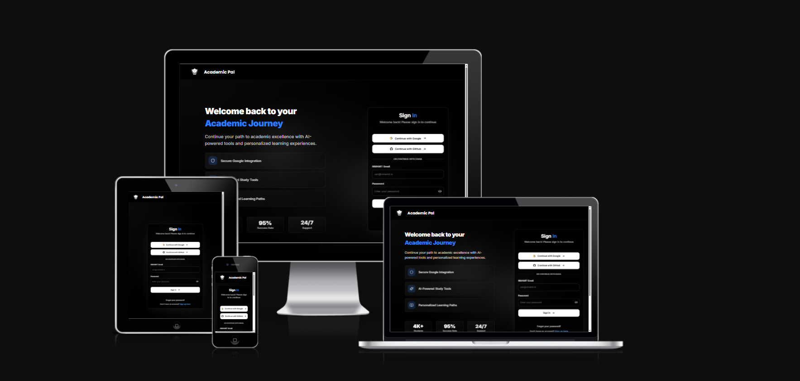
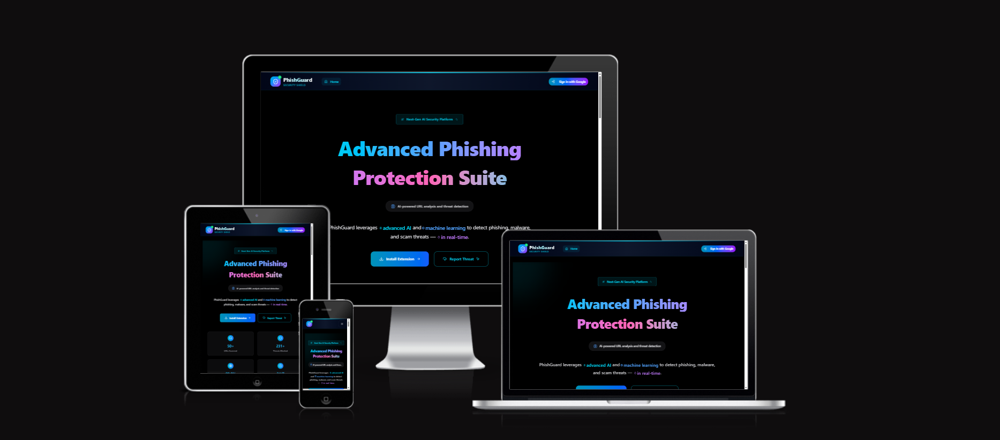
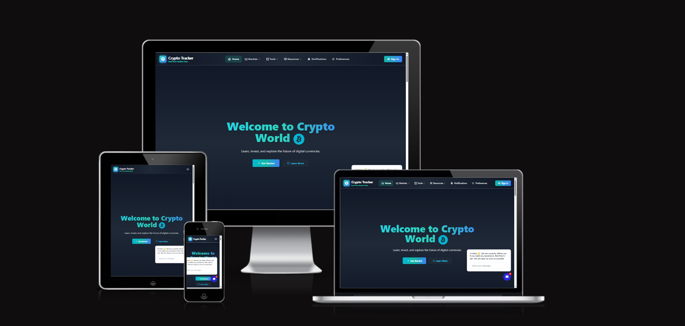

  
  
  

  

---

## About Me

**B.Tech CSE** at **NMAMIT** | **Founder & Full Stack Developer**

Passionate about transforming ideas into reality through code. Building scalable web applications and educational platforms that create meaningful impact.

  
  
  

---

## Featured Projects

  <h3>Technical Excellence in Action</h3>

---

### Academic Pal
> **Educational Platform for B.Tech Students | 5000+ Active Users**

<table>
<tr>
<td width="65%">

A comprehensive platform offering notes and resources for B.Tech students, organized by year and branch.

**Key Features:**
- Comprehensive study materials organized by year & branch
- Curated notes from top performers
- Subject-wise resource organization
- Smart search functionality
- Progress tracking and analytics

**Impact**: Serving **5000+** students with high-quality educational resources

</td>
<td width="35%">

</td>
</tr>
</table>

  
  
  
  
  
  

  
  

---

### PhishGuard
> **Comprehensive Cybersecurity Platform | Chrome Extension + Web Platform**

<table>
<tr>
<td width="65%">

A comprehensive cybersecurity platform designed for students and educational institutions using advanced AI and machine learning for real-time protection.

**Key Features:**
- **Link Scanner**: Detect malicious URLs in real-time
- **Document Scanner**: Analyze files for potential threats
- **Email Scanner**: Identify phishing attempts in emails
- **Gamification**: Engaging security awareness training
- **Scam Reporting System**: Community-driven threat reporting
- **Chrome Extension**: Security at your fingertips

**AI-Powered**: Advanced machine learning algorithms for threat detection

</td>
<td width="35%">

</td>
</tr>
</table>

  
  
  
  
  
  

  
  

---

### Crypto Tracker
> **Real-Time Cryptocurrency Intelligence Platform**

<table>
<tr>
<td width="65%">

A state-of-the-art web application revolutionizing how users interact with cryptocurrency markets.

**Mission**: Democratize cryptocurrency knowledge and trading with an intuitive, feature-rich platform.

**Key Features:**
- **Real-time Market Intelligence**: Live price feeds & market analysis
- **Social Trading Community**: Connect with fellow crypto enthusiasts
- **Educational Resources**: Learn from beginner to expert level
- **AI-Powered Insights**: Smart recommendations & market predictions
- **Multi-Platform Support**: Seamless experience across all devices
- **Real-time Communication**: Socket.IO powered live updates

</td>
<td width="35%">

</td>
</tr>
</table>

  
  
  
  
  
  
  
  
  
  

  

---

### AgroPulse
> **Smart Agricultural Marketplace Platform**

<table>
<tr>
<td width="65%">

Empowering farmers with real-time market intelligence and direct buyer connections.

**Problems Solved:**
- Unfair pricing for farmers
- Low bargaining power
- Middlemen-dominated markets
- Delayed price updates

**Key Features:**
- **Real-time Market Prices**: Live commodity pricing
- **Demand Insights**: Data-driven market analysis
- **Direct Buyer Connections**: Eliminate middlemen
- **Fair Pricing System**: Transparent transactions
- **User-Friendly Interface**: Easy access for all farmers

**Impact**: Increasing farmer income through efficient agricultural trade

</td>
<td width="35%">

</td>
</tr>
</table>

  
  
  
  
  

  

---

## Tech Stack

### Frontend

  
  
  
  

### Styling

  
  
  

### Backend

  
  
  

### Databases

  
  
  
  
  

### DevOps & Tools

  
  
  
  

---

## Achievements

<table>
<tr>
<td width="50%">

### Hackathon Wins
- **SAP Hackfest Winner** - Regional Level
- **Upgrade Campus Hackathon** - First Place
- **Web Development ACE Competition** - First Place
- **Acethon** - First Place
- **Reality Rewritten 24hrs** - 2nd Runner up
- **Codesprint Hackathon 32hrs** - 2nd Runner up
- **Srinathon** - Runner up (2 problem statements)

</td>
<td width="50%">

### Professional
- **Founder** - Academic Pal (5000+ Users)
- **Co-founder** - We4Tech Community
- **Freelance** - 17+ Happy Clients
- **Open Source** - 10+ Contributions

</td>
</tr>
</table>

---

## GitHub Statistics

  

  

  

  

  

---

## Connect

  
  
  
  
  
  

### Open To

  
  
  
  

---

  

