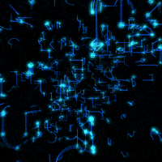

# 💫 About Me:

👋 Hi there! I'm **Hariharanath**, a passionate second-year **B.Tech student** specializing in **CSE (Full Stack Development)** at **NMAMIT**.  

🚀 I am the **Founder of Academic Pal**, a platform dedicated to providing **educational resources and notes** to college students, making learning more accessible and effective.  

🤝 **Co-founder of We4Tech**, a budding initiative focused on **tech innovation and community building**, empowering developers to create impactful solutions.  

## 🌐 Socials

 
 
 
 

---

## 💻 Tech Stack

## 🚀 What I Do

### 🌱 Startup Enthusiast  
Currently learning and experimenting with startup strategies, aiming to launch ventures that tackle real-world challenges and foster innovation.  

### 💻 Developer  
Passionate about coding, I specialize in **JavaScript**, **React.js**, **Next.js**, and the **MERN stack**. I love building dynamic web applications and exploring the latest web development trends.  

---

## 🔥 **Skills & Interests**

- **🌐 Developer Expertise**  
Skilled in **JavaScript**, **React.js**, **Next.js**, and the **MERN stack** (MongoDB, Express, React, Node.js). I create seamless, interactive web applications using modern technologies.  

- **🚀 Startup Strategy**  
Experimenting with innovative strategies to launch successful ventures that solve real-world problems, creating impact and value.  

---

## 📚 **Learning and Goals**

- **🚀 Startup Strategy**  
  Experimenting with new strategies to launch and grow innovative ventures that address key challenges and create meaningful solutions.
  
- **💡 Web Development**  
  Continuously improving my knowledge of **Next.js**, the **MERN stack**, and **TypeScript**, while diving deeper into interactive web technologies and full-stack development.

## 📊 GitHub Stats

  

 

---
## 🏆 GitHub Trophies

## ✍️ Random Dev Quote

## 🔝 Top Contributed Repos

)

Designed with ❤️ by Hari

---

