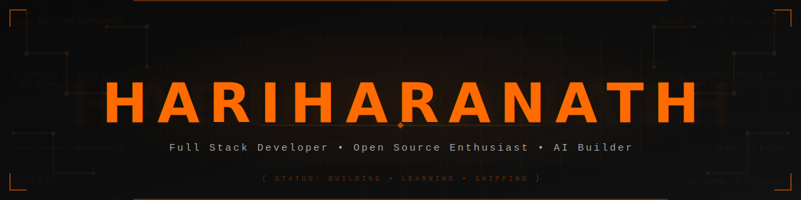

<div align="center">
  


[](https://git.io/typing-svg)

<br/>


</div>

<br/>

```bash
$ cat /etc/profile
```

```
  name     : Hariharanath
  role     : Full Stack Developer & Founder
  college  : B.Tech CSE @ NMAMIT (2026)
  founded  : Academic Pal (5000+ users) · We4Tech Community
  wins     : 7+ Hackathon Champion — SAP Hackfest · Acethon · Web Dev ACE
  clients  : 17+ Freelance Projects Delivered
  seeking  : Startups · MNCs · Consulting · Freelance
```

<br/>

```bash
$ ls -la ~/projects/
```

```
drwxr-xr-x  academic-pal/       ── Ed-tech platform · 5000+ active users
drwxr-xr-x  phishguard/         ── AI cybersecurity · Chrome extension
drwxr-xr-x  crypto-tracker/     ── Real-time market intelligence · Socket.IO
drwxr-xr-x  agropulse/          ── AgriTech marketplace · Direct trade
```

<br/>

**`~/projects/academic-pal`**
> Notes, resources & study tools for B.Tech students. Organized by year, branch & subject. Serving 5000+ students across multiple colleges.

`Next.js` `TypeScript` `MongoDB` `Firebase` `TailwindCSS`
&nbsp; → &nbsp;[academicpal.in](https://academicpal.in) &nbsp;|&nbsp; [github](https://github.com/Hari-hara7/Academicpal--login)

<br/>

**`~/projects/phishguard`**
> AI-powered phishing detection platform. Scans links, documents & emails in real-time. Comes with gamified security training + a Chrome Extension.

`Next.js` `TypeScript` `TensorFlow` `Firebase` `TailwindCSS`
&nbsp; → &nbsp;[live demo](https://phish-guard-six.vercel.app) &nbsp;|&nbsp; [github](https://github.com/Hari-hara7/PhishGuard)

<br/>

**`~/projects/crypto-tracker`**
> Live crypto intelligence with AI-driven insights, social trading community, and real-time Socket.IO-powered price feeds.

`React` `TypeScript` `Node.js` `MongoDB` `Socket.IO`
&nbsp; → &nbsp;[live demo](https://crypto-beta-five.vercel.app)

<br/>

**`~/projects/agropulse`**
> Smart agri-marketplace connecting farmers directly to buyers. Real-time commodity pricing, zero middlemen, transparent transactions.

`Next.js` `T3 Stack` `Prisma` `TailwindCSS`
&nbsp; → &nbsp;[live demo](https://trikernel-fn61.vercel.app)

<br/>

```bash
$ cat ~/.config/stack
```

```yaml
frontend:
  - React · Next.js · TypeScript · JavaScript
  - TailwindCSS · shadcn/ui · Framer Motion

backend:
  - Node.js · Express · tRPC · Python

database:
  - MongoDB · PostgreSQL · Firebase · Prisma

devops:
  - Docker · GitHub Actions · Vercel · AWS
```

<br/>

```bash
$ github-stats --user hari-hara7
```
| Repository Activity Trends | Collaborative Productivity - Last 28 days |
| ----------- | ----------- |
|||

| Repository Performance Stats - Last 28 days | Active Contributors - Last 28 days |
| ----------- | ----------- |
|||


| Pull Request Size | Pull Request Lifecycle |
| ----------- | ----------- |
|||


| Currently Working On - Last 28 days | Top Active Contributors - Last 28 Days |
| ----------- | ----------- |
|||


<br/><br/>


<br/><br/>


<br/><br/>


</div>

<br/>

```bash
$ cat ~/achievements.log
```

```
[2022–2024] ............................................
  ✦  SAP Hackfest              → 1st Place
  ✦  Acethon                   → 1st Place
  ✦  Web Dev ACE               → 1st Place
  ✦  Upgrade Campus            → 1st Place
  ✦  Srinathon 2.0             → 2× 2nd Place Winner
  ✦  Reality Rewritten         → 2nd Runner Up
  ✦  Codesprint                → 2nd Runner Up
  ✦  Academic Pal              → 5000+ users
  ✦  Freelance                 → 17+ clients
  ✦  Open Source               → 10+ contributions
  ✦  We4Tech Community         → Co-founded
```

<br/>

```bash
$ ping hariharanath --connect
```

```
PING hariharanath ... response time: instant
```

<div align="center">

[](mailto:hariharanath247@gmail.com)
&nbsp;
[](https://linkedin.com/in/Harihara-nath)
&nbsp;
[](https://hari-hara7.github.io)
&nbsp;
[](https://x.com/@Hariharana70309)
&nbsp;
[](https://instagram.com/Hari_hara_nath77)

<br/><br/>

```
[session active] root@hari:~$ █
```

</div>
