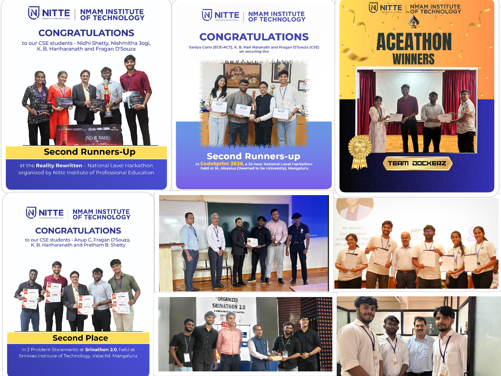
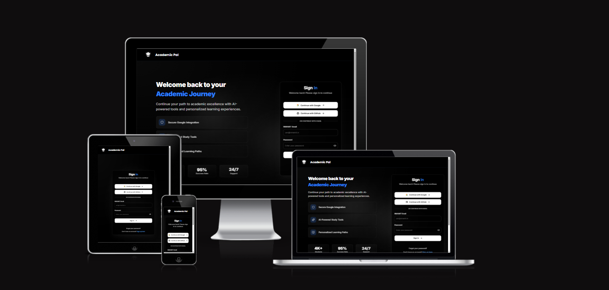
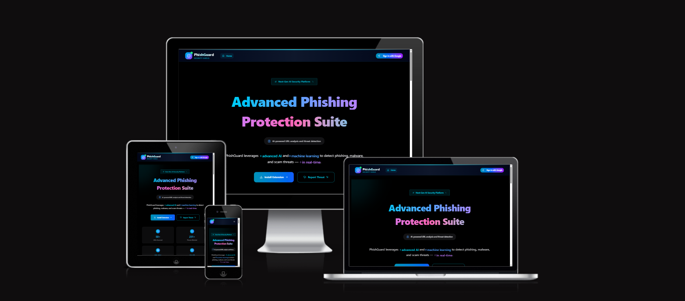
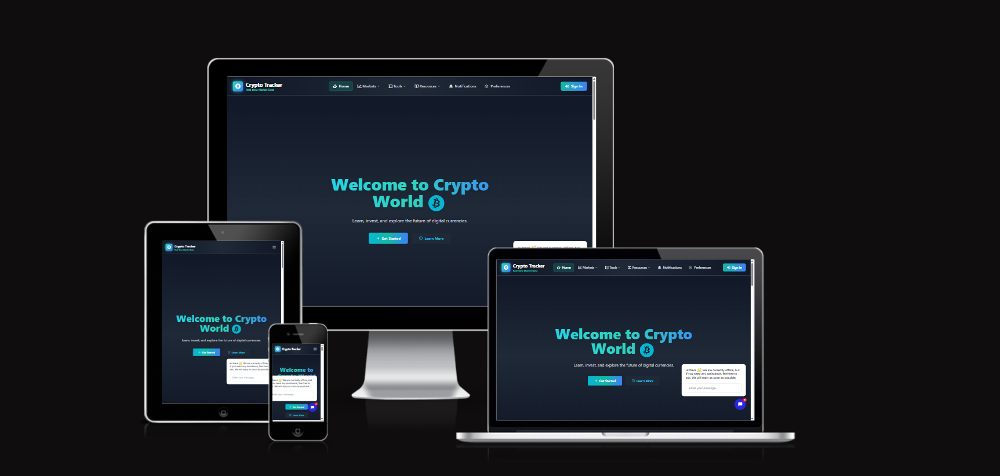

<!-- ═══════════════════════════════════════════════════════════════════════════════ -->
<!-- HEADER SECTION -->
<!-- ═══════════════════════════════════════════════════════════════════════════════ -->

 

  
  
  

  
  
  

<!-- ═══════════════════════════════════════════════════════════════════════════════ -->
<!-- HACKATHON WINS SECTION -->
<!-- ═══════════════════════════════════════════════════════════════════════════════ -->

  

  

  
  
  

  
  
  

<!-- ═══════════════════════════════════════════════════════════════════════════════ -->
<!-- ABOUT ME SECTION -->
<!-- ═══════════════════════════════════════════════════════════════════════════════ -->

  

<table>
<tr>
<td width="55%">

### Hi, I'm Harihara Nath! 👋

**B.Tech CSE** at **NMAMIT** | **Founder & Full Stack Developer**

Passionate about transforming ideas into reality through code. Building scalable web applications and educational platforms that create meaningful impact.

- 🎓 Currently pursuing **B.Tech in Computer Science**
- 🚀 Founder of **Academic Pal** (5000+ Active Users)
- 💼 Co-founder of **We4Tech Community**
- 🏆 Multiple **Hackathon Champion**
- 💻 **17+ Happy Freelance Clients**
- 🌟 **10+ Open Source Contributions**

</td>

</tr>
</table>

  
  
  

<!-- ═══════════════════════════════════════════════════════════════════════════════ -->
<!-- FEATURED PROJECTS SECTION -->
<!-- ═══════════════════════════════════════════════════════════════════════════════ -->

  

<!-- PROJECT 1: Academic Pal -->

 
<b>Educational Platform for B.Tech Students | 5000+ Active Users</b>

  

<table>
<tr>
<td width="60%">

A comprehensive platform offering notes and resources for B.Tech students, organized by year and branch.

**Key Features:**
- 📖 Comprehensive study materials by year & branch
- ⭐ Curated notes from top performers
- 🔍 Smart search functionality
- 📊 Progress tracking and analytics

**Impact**: Serving **5000+** students with high-quality educational resources

</td>
<td width="40%">

</td>
</tr>
</table>

  
  
  
  
  

  
  

 

<!-- PROJECT 2: PhishGuard -->

 
<b>Cybersecurity Platform | Chrome Extension + Web Platform</b>

  

<table>
<tr>
<td width="60%">

A comprehensive cybersecurity platform designed for students and educational institutions using advanced AI/ML for real-time protection.

**Key Features:**
- 🔗 **Link Scanner**: Detect malicious URLs
- 📄 **Document Scanner**: Analyze file threats
- 📧 **Email Scanner**: Identify phishing attempts
- 🎮 **Gamification**: Security awareness training
- 🔌 **Chrome Extension**: Security at your fingertips

</td>
<td width="40%">

</td>
</tr>
</table>

  
  
  
  
  

  
  

 

<!-- PROJECT 3: Crypto Tracker -->

 
<b>Real-Time Cryptocurrency Intelligence Platform</b>

  

<table>
<tr>
<td width="60%">

A state-of-the-art web application revolutionizing how users interact with cryptocurrency markets.

**Key Features:**
- 📈 **Real-time Market Intelligence**: Live price feeds
- 👥 **Social Trading Community**: Connect with enthusiasts
- 📚 **Educational Resources**: Beginner to expert
- 🤖 **AI-Powered Insights**: Smart recommendations
- 🔄 **Socket.IO**: Real-time communication

</td>
<td width="40%">

</td>
</tr>
</table>

  
  
  
  
  

  

 

<!-- PROJECT 4: AgroPulse -->

 
<b>Smart Agricultural Marketplace Platform</b>

  

<table>
<tr>
<td width="60%">

Empowering farmers with real-time market intelligence and direct buyer connections.

**Key Features:**
- 💵 **Real-time Market Prices**: Live commodity pricing
- 📊 **Demand Insights**: Data-driven market analysis
- 🤝 **Direct Buyer Connections**: Eliminate middlemen
- ⚖️ **Fair Pricing System**: Transparent transactions

**Impact**: Increasing farmer income through efficient trade

</td>
<td width="40%">

</td>
</tr>
</table>

  
  
  
  

  

<!-- ═══════════════════════════════════════════════════════════════════════════════ -->
<!-- TECH STACK SECTION -->
<!-- ═══════════════════════════════════════════════════════════════════════════════ -->

  

<table>
<tr>
<td valign="top" width="33%">

### 🎨 Frontend

   
   
   
  

</td>
<td valign="top" width="33%">

### ⚙️ Backend

   
   
   
  

</td>
<td valign="top" width="33%">

### 🗄️ Database

   
   
   
  

</td>
</tr>
</table>

<table>
<tr>
<td valign="top" width="50%">

### 🎭 Styling & UI

  
  
  

</td>
<td valign="top" width="50%">

### 🔧 DevOps & Tools

  
  
  
  

</td>
</tr>
</table>

<!-- ═══════════════════════════════════════════════════════════════════════════════ -->
<!-- ACHIEVEMENTS SECTION -->
<!-- ═══════════════════════════════════════════════════════════════════════════════ -->

  

<table>
<tr>
<td align="center" width="33%">

<h3>Hackathons</h3>
<b>7+ Wins</b> 
SAP Hackfest Winner 
Multiple 1st Places
</td>
<td align="center" width="33%">

<h3>Professional</h3>
<b>Founder</b> - Academic Pal 
<b>Co-founder</b> - We4Tech 
Freelance Developer
</td>
<td align="center" width="33%">

<h3>Impact</h3>
<b>5000+</b> Users 
<b>17+</b> Happy Clients 
<b>10+</b> Open Source
</td>
</tr>
</table>

<!-- ═══════════════════════════════════════════════════════════════════════════════ -->
<!-- GITHUB STATISTICS SECTION -->
<!-- ═══════════════════════════════════════════════════════════════════════════════ -->

  

<!-- Quick Stats Badges -->

  
  
  

 

<!-- Stats + Streak Row -->

  
  

 

<!-- Languages Card -->

  

 

<!-- Contribution Graph -->

  

<!-- Snake Animation -->
<picture>
  <source media="(prefers-color-scheme: dark)" srcset="https://raw.githubusercontent.com/platane/snk/output/github-contribution-grid-snake-dark.svg" />
  <source media="(prefers-color-scheme: light)" srcset="https://raw.githubusercontent.com/platane/snk/output/github-contribution-grid-snake.svg" />
  
</picture>

  

<!-- GitHub Trophies -->

  

<!-- Pinned Repos -->

  
  

<!-- ═══════════════════════════════════════════════════════════════════════════════ -->
<!-- CONNECT SECTION -->
<!-- ═══════════════════════════════════════════════════════════════════════════════ -->

  

  
  
  
  
  
  

 

  

  
  
  
  

<!-- ═══════════════════════════════════════════════════════════════════════════════ -->
<!-- FOOTER SECTION -->
<!-- ═══════════════════════════════════════════════════════════════════════════════ -->

 

  

  <b>⭐ Star my repos if you find them useful!</b>

**Made with 💜 and Code**

